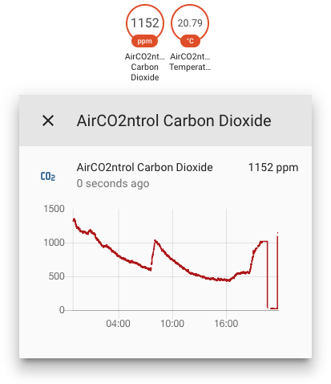

# Aircontrol CO2 Monitor Mini TFA

A custom [home-assistant](https://www.home-assistant.io/) component for a family of compatible CO2 monitors distributed under various names
 - [TFA Dostmann CO2 Monitor AIRCO2NTROL MINI](https://www.tfa-dostmann.de/en/produkt/co2-monitor-airco2ntrol-mini/).
 - [ZyAura ZGm053U](https://www.zyaura.com/product-detail/zgm053u/)
 - [TFA Dostmann CO2 Monitor AIRCO2NTROL COACH](https://www.tfa-dostmann.de/en/product/co2-monitor-airco2ntrol-coach-31-5009/)
 - [ZyAura ZGm27](https://www.zyaura.com/product-detail/zgm27/)

Idea based on "[Reverse-Engineering a low-cost USB CO₂ monitor](https://hackaday.io/project/5301-reverse-engineering-a-low-cost-usb-co-monitor)".
Thx [Henryk Plötz](https://hackaday.io/henryk). Code for this HA integration originally taken from [jansauer](https://github.com/jansauer/home-assistant_config/tree/master/config/custom_components/airco2ntrol). 
But because the "Decryption" part isn't necessary anymore with the current generation of devices I removed that. 

Upload this folder to `custom_components` in your configuration folder (using Samba or FTP addons)
Add the following platform to your `configuration.yaml`:
```
# Example configuration.yaml entry
sensor:
  - platform: airco2ntrol
```



## CONFIGURATION VARIABLES

In the sensor.py following variable can be changed if you have multiple hidraw devices connected:
- **device** Hidraw device node. (default = '/dev/hidraw0')

## Developers notice
The pdf in this repository describes the usb protocol. There exists more than just co2 and temperature readings.
Some devices appear to have a humidity reading but mine does only display "0" for humidity (opcode: 0x41).


