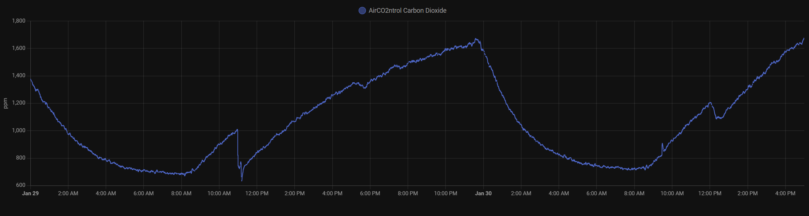

# Aircontrol CO2 Monitor Mini TFA

A custom [home-assistant](https://www.home-assistant.io/) component for a family of compatible CO2 monitors distributed under various names
 - [TFA Dostmann CO2 Monitor AIRCO2NTROL MINI](https://www.tfa-dostmann.de/en/produkt/co2-monitor-airco2ntrol-mini/).
 - [ZyAura ZGm053U](https://www.zyaura.com/product-detail/zgm053u/)
 - [TFA Dostmann CO2 Monitor AIRCO2NTROL COACH](https://www.tfa-dostmann.de/en/product/co2-monitor-airco2ntrol-coach-31-5009/)
 - [ZyAura ZGm27](https://www.zyaura.com/product-detail/zgm27/)

Idea based on "[Reverse-Engineering a low-cost USB CO₂ monitor](https://hackaday.io/project/5301-reverse-engineering-a-low-cost-usb-co-monitor)".
Thx [Henryk Plötz](https://hackaday.io/henryk). Code for this HA integration originally taken from [jansauer](https://github.com/jansauer/home-assistant_config/tree/master/config/custom_components/airco2ntrol). 
But because the "Decryption" part isn't necessary anymore with the current generation of devices I removed that. 

## Setup
If you had the old version from this repository installed, remove ``airco2ntrol`` from your `configuration.yaml`
### Automatic
(soon) Visit HACS and install the airco2ntrol from there

### Manual
1. Upload the `airco2ntrol` folder to your `custom_components` folder (using Samba or FTP addons).
It should look like `custom_components/airco2ntrol/`.
2. Restart your Home Assistant.
3. Go to your Integrations, click on "ADD INTEGRATION" and search for "`co2`"
4. choose ``airco2ntrol`` and click on "SUBMIT"
5. The integration should create 3 entities as soon as you have the CO2 sensor attached to your server

## Functionality
This is how the sensors measurement might look. _Please note that I do not do enough "stosslueften"
([German Wiki: run this through your favourite translator](https://de.wikipedia.org/wiki/L%C3%BCftung#Sto%C3%9Fl%C3%BCftung))._

The Integration should provide:
 - CO2 values
 - Temperature
 - OPTIONAL: Humidity

There might exist more than only co2 and temperature readings. 
Some devices appear to have a humidity readings, but mine does only display "0" for humidity data (opcode: 0x41).

## Notes

The pdf in this repository describes the usb protocol used by airco2ntrol

